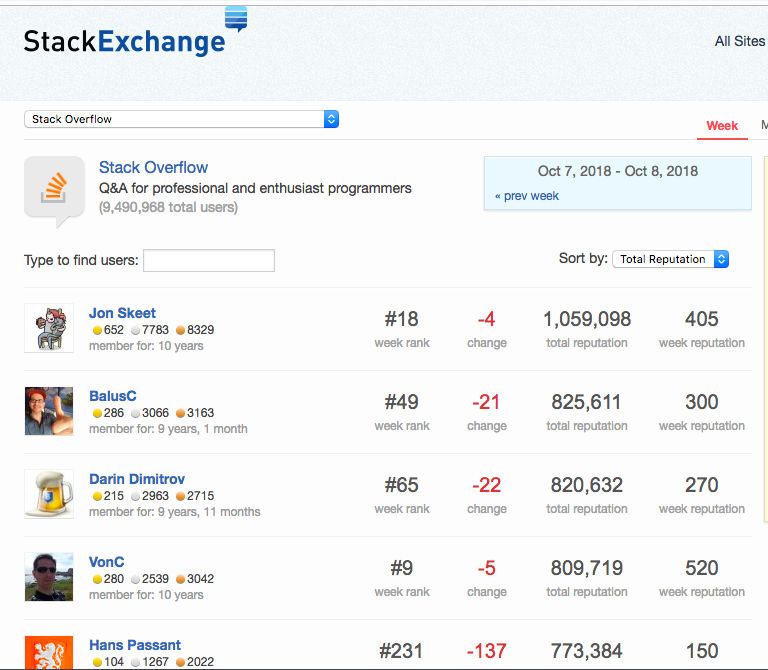
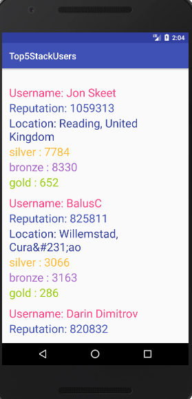

# Top5StackUsers
An Android App that uses the Retrofit Library and Stack Exchange API to get top 5 users with the highest reputation in Descending order. 
It shows following information of each user:
- User name
- Reputation
- Location
- Silver
- Bronze
- Gold

# Stack Exchange Website Screenshot
Following is the data that we have to display in our android application : -

# Android Application Screenshot
This is the screenshot of the application showing top 5 users according to their reputation.

